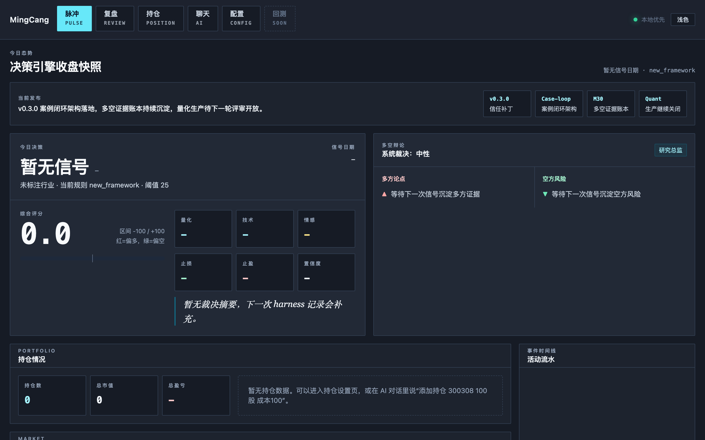

# 明仓

**明仓是一个本地优先的个人 A 股研究决策工作台。** 它把"看好一只票"这件事拆成一条可审计的闭环——**进口判断 → 记录证据 → 证伪 → 跟踪 → 复盘归因 → 记忆更新**——让每一次判断都能被回看、被反驳、被验证，让每一次结果都沉淀成下次能用的证据。

愿景不是做一个更聪明的"预测 AI"，而是给个人投资者一套**研究操作系统**：

- **你** 负责 alpha、行业认知和最终决策；
- **AI** 负责广度扫描、证伪和短期风险纪律；
- **系统** 负责把判断和结果沉淀成一套会成长的记忆。

[](https://github.com/Zeeechenn/MingCang/actions/workflows/test.yml)
[](https://github.com/Zeeechenn/MingCang/releases)


**语言**：[简体中文](README.md) · [English](README_EN.md)

---

## 这个项目能帮你做什么

| 你想做的事 | 明仓怎么接 |
|---|---|
| **研究一只票** | `mingcang stock 000001` 拉出信号、新闻、标签、研究 copilot 影子结论，并把你的判断记成一条 `ResearchCase` |
| **跟踪一个长期主题/赛道** | 把成熟外部研究者、券商/机构、景气与财务质量框架的论题进口为 `ForwardThesis`，带失效条件和复盘节奏，长期持续跟踪 |
| **盯住每天的信号和风险** | 技术因子 + LLM 新闻情感生成官方信号，ATR 移动止损保护浮盈，组合暴露和数据质量自动预警 |
| **复盘并积累经验** | 结果出来后做归因，证伪命中/错过都记分，经人工确认才促进成可信记忆，下次判断更有依据 |
| **让 AI 帮你干上面这些** | 自带 `mingcang` Pi 终端，也可接 Claude Code / Codex / Cursor，通过 CLI / MCP 调用全部能力 |

明仓不替你做主：**LLM 不预测价格、不下单、不自动改信号**，止盈止损是 ATR 公式算出来的规则，记忆要等结果和人工确认才升级。→ 详见 [为什么明仓不是 AI 选股器](docs/WHY_NOT_AI_STOCK_PICKER.md)

---

## 3 分钟上手（无需真实 Key / 网络）

```bash
git clone https://github.com/Zeeechenn/MingCang.git
cd MingCang
make demo        # 用 mock 数据跑一轮完整演示，无需配置任何 key 或网络
```



<!-- TODO: 后续可补一段操作 GIF（添加标的→研究卡→证伪→复盘→记忆候选）。 -->

---

## 架构：研究决策闭环

0.3.0 把整套研究模型重做成一套**案卷式闭环架构**：用四类"案卷"（Case）把研究、信号、持仓、复盘串成一条闭环，分五层（L0–L4）承载，每一类只回答一个问题，彼此可链接、可审计。


```
进口（数据 + 新闻 + 你的判断 + 外部论题）
        │
        ▼
  ResearchCase ──▶ SignalCase ──▶ PositionCase ──▶ ReviewCase
   为什么值得研究    现在能交易吗     为何持有/何时退      结果教会了什么
        ▲                                                  │
        └────────── 记忆更新（outcome-gated，人工确认）◀────┘
```

五层（L0 记忆 → L1 证据 → L2 论题 → L3 信号/持仓 → L4 复盘/校准）分别回答"学到了什么 / 有哪些证据 / 值得研究吗 / 能交易吗 / 结果教会了什么"，彼此可链接、可审计。→ [完整架构说明](docs/ARCHITECTURE.md)

> **现状说明**：这套闭环架构已经落地，但默认**休眠**——骨架先就位、生产信号零改动，等前向证据门控逐层通过后再激活。当前生产信号仍是技术 0.6 + 情感 0.4 + ATR 2.5 移动止损，量化层关闭（`WEIGHT_QUANT=0.0`）、等待证据。

---

## 当前能力

| 层 | 做什么 |
|---|---|
| 数据 | 行情、新闻、财务、QFII、A/HK/US 只读全球数据，本地 SQLite，不上云 |
| 信号 | 技术因子 + LLM 新闻情感，生产权重 0.6 / 0.4，ATR 2.5 移动止损 |
| 研究 | 个股 dossier、deep research、假设进口、证伪记分牌、外部研究员 / 机构研究导入 |
| 记忆 | 分层记忆，outcome-gated 促进，审计日志可回溯 |
| Agent | 自带 `mingcang` Pi 终端 + MCP / CLI，供 Claude Code / Codex / Cursor 调用 |
| 界面 | React 前端 + REST API，本地优先 |

---

## 快速开始

明仓自带一个 **`mingcang` Pi 终端壳**——把整套 CLI、记忆、研究流程和安全边界打包成一个开箱即用的 agent 终端，不用记一堆命令就能用。

```bash
curl -fsSL https://raw.githubusercontent.com/Zeeechenn/MingCang/main/scripts/install.sh | sh
mingcang
```

装好后直接对它说人话即可（"看一下 300308"、"扫一遍自选"、"帮我复盘上周的票"），它会自己读项目上下文、跑 CLI、给出研究和风险结论。

手动安装 / 开发模式：

```bash
git clone https://github.com/Zeeechenn/MingCang.git
cd MingCang
make agent-setup   # 准备环境
make agent         # 启动 Pi 终端
```

默认 `AI_PROVIDER=local_cli`，走本机已登录的 Claude CLI，不需要云端 key。也可以直接用底层 CLI：

```bash
python3 -m backend.agent.cli health --pretty
python3 -m backend.agent.cli premarket --pretty
python3 -m backend.agent.cli stock-context 000001 --pretty
```

> 迁移说明：旧 `stocksage` 命令、`stock_sage_*` MCP 工具、`STOCKSAGE_AGENT_*` 环境变量在过渡期仍可用；新安装建议使用 `mingcang`。

---

## 使用指南

装好后，既能对 `mingcang` Pi 终端直接说人话，也能跑底层 CLI。下面是几个最常见的用法。

### 研究某一只股票

对 Pi 终端说："研究一下中际旭创"、"看看 300308 现在怎么样"。它会先拉股票上下文，再给结论：

```bash
python3 -m backend.agent.cli stock-context 300308 --pretty
```

你会拿到：官方信号（买入 / 关注 / 规避）、最近新闻与情感、长期标签、研究 copilot 的影子结论，以及它列出的风险和待验证问题。需要更深的调研时，让它跑一轮 deep research：

```bash
python3 -m backend.agent.cli action research.deep.run \
  --payload-json '{"topic":"光模块 1.6T 需求","symbols":["300308"]}' --pretty
```

### 每天看一遍信号

明仓按交易节奏分了四个一句话工作流：

```bash
python3 -m backend.agent.cli premarket  --pretty   # 盘前：同步前检查与当日入口
python3 -m backend.agent.cli intraday   --pretty   # 盘中：只读本地缓存的快速个股入口
python3 -m backend.agent.cli postmarket --pretty   # 盘后：全市场信号与复盘报告
python3 -m backend.agent.cli weekend    --pretty   # 周末：长期标签刷新与周度反思
```

Pi 终端里直接说"盘前扫一遍"、"收盘后复盘一下"即可。信号里包含当日建议、ATR 移动止损位、组合暴露和数据质量预警——明仓不替你下单，只给纪律。

### 维护一个关注列表

加自选（默认 dry-run，确认后加 `--confirm` 落库）：

```bash
python3 -m backend.agent.cli action watchlist.add \
  --payload-json '{"symbol":"300308","name":"中际旭创","market":"CN"}' --pretty
```

移除用 `watchlist.remove`。之后用 `project-context` 或盘后工作流扫一遍整张自选表。对 Pi 终端说"把中际旭创加进自选"、"扫一遍我的关注列表"也可以。

### 做长期研究并持续跟踪

把一个赛道或主题的判断（来自你自己、成熟研究者或景气/财务框架）记成一条带失效条件的论题，系统会长期跟踪、到点提醒复盘：

```bash
python3 -m backend.agent.cli action long_term.run --payload-json '{"symbol":"300308"}' --pretty
```

它不会因为论题"听起来有道理"就抬高买入分——只有结果兑现、复盘通过，这条判断才会升级成可信记忆，喂给下一次研究。

### 让记忆为你工作

```bash
python3 -m backend.agent.cli memory-snapshot --pretty
```

这里能看到分层记忆、审计日志和记忆促进状态：哪些规则 / 教训已可信，哪些还在待定。可信记忆会在你下次研究同一只票或同一赛道时，自动作为上下文注入。

---

## Agent 接入

外层 agent（Pi / Claude Code / Codex / Cursor）接入时，默认只需要：

1. 读 [AGENTS.md](AGENTS.md)——了解本地 / 远程边界
2. 按需加载 `STATUS.md` / `PROJECT.md` / `docs/ROADMAP.md`
3. 写操作先 dry-run，等用户确认

核心 MCP 工具：

| 工具 | 用途 |
|---|---|
| `mingcang_project_context` | 持仓、自选、记忆摘要、配置概况 |
| `mingcang_stock_context` | 单只股票：信号、新闻、标签、copilot shadow |
| `mingcang_memory_snapshot` | 分层记忆、审计日志、记忆促进状态 |
| `mingcang_health` | 数据库、依赖、权限健康检查 |

旧 `stock_sage_*` 工具名保留为兼容别名。

---

## 配置

<details>
<summary><b>本地与远程配置</b></summary>

```env
AI_PROVIDER=local_cli
DATABASE_URL=sqlite:////absolute/path/to/mingcang.db
MINGCANG_AGENT_MODE=local
```

远程暴露是 opt-in，默认只读：

```env
MINGCANG_AGENT_MODE=remote
MINGCANG_AGENT_API_KEY=your_secret_key
MINGCANG_AGENT_REMOTE_WRITE_ENABLED=false
MINGCANG_AGENT_REMOTE_WRITE_ACTIONS=
```

旧 `STOCKSAGE_AGENT_*` 变量名仍可读取，新部署推荐用 `MINGCANG_AGENT_*`。`.env`、数据库、个人交易记录、真实 key 不进 Git。

</details>

---

## 文档索引

| 文件 | 内容 |
|---|---|
| [AGENTS.md](AGENTS.md) | Agent 使用规则和安全边界 |
| [PROJECT.md](PROJECT.md) | 代码库导航和关键文件索引 |
| [STATUS.md](STATUS.md) | 当前生产状态、信号权重、测试入口 |
| [CHANGELOG.md](CHANGELOG.md) | 版本历史和已完成更新 |
| [CONTRIBUTING.md](CONTRIBUTING.md) | 开发环境和贡献流程 |
| [docs/ARCHITECTURE.md](docs/ARCHITECTURE.md) | L0–L4 层架构、Case 类型、融合逻辑完整说明 |
| [docs/WHY_NOT_AI_STOCK_PICKER.md](docs/WHY_NOT_AI_STOCK_PICKER.md) | 为什么明仓不是 AI 选股器：LLM 边界、ATR 纪律、记忆门控 |

---

## 从 StockSage 到明仓

项目前身是 **StockSage**，0.3.0 起正式更名为 **明仓 / MingCang**。这次升级不只是换名字：

- 把整套研究模型重做成案卷式研究决策闭环（研究 → 信号 → 持仓 → 复盘 → 记忆）；
- 定位转向"放大人的判断、用前向证据守门"，新增论题进口通道和证伪记分牌；
- 新增开箱即用的 `mingcang` Pi 终端壳，降低使用门槛；
- 扩展 A/HK/US 只读全球数据，强化数据质量与复权口径护栏。

旧 `stocksage` 命令、`stock_sage_*` 工具、`STOCKSAGE_AGENT_*` 变量在过渡期仍兼容。

---

## 声明

明仓是个人研究工具，**不构成投资建议**。系统不自动下单，LLM 不做价格预测，止盈止损由 ATR 公式和风险约束生成。所有交易决策和资金风险由使用者自行承担。

---

## 未来方向

明仓想做的事，一句话：**让 AI 放大你的判断，而不是替你拍脑袋**。它分两块——怎么做研究，和把工具做得更好用。

**研究上，坚持几条原则：**

- **真正能赚钱的判断来自人，不来自模型硬猜。** 主力还是你自己、以及你信得过的研究者和成熟框架（景气、财务质量）给出的判断；明仓负责帮你把这些判断盯住、查漏、提醒，而不是靠价格走势"算命"——这条路我们回测过，没有效果。
- **AI 只做两件事：扩广度、挑毛病。** 广度是帮你扫到一个人看不过来的新闻和线索，但它给的永远是"还没被验证的猜想"；挑毛病是替你反驳假设、盯着失效条件、在亏损前预警。
- **AI 想变得更聪明可以，但得拿结果证明。** 任何新模型、新能力都允许尝试，但要先在真实结果上证明自己靠谱，才能影响你的决策；在那之前，最终拍板的永远是你。
- **只记住被结果验证过的经验。** 一条判断对不对，要等结果出来、复盘通过才算数——不会因为"讲得有道理"就被系统当成真理记下来。

**工具上，接下来要做的：**

- **接入港股和美股。** 现在 A 股是主战场，港股 / 美股还停在只读研究态；下一步把它们做成和 A 股一样可研究、可跟踪、可复盘的完整链路。
- **打磨前端和后端。** 把研究面板、信号展示、复盘记录做得更顺手，后端做得更稳、更快、更好维护。
- **做成真正好用的软件。** 目标是让不写代码的人也能一键装好、开箱即用，而不只是一套给开发者的脚本。
